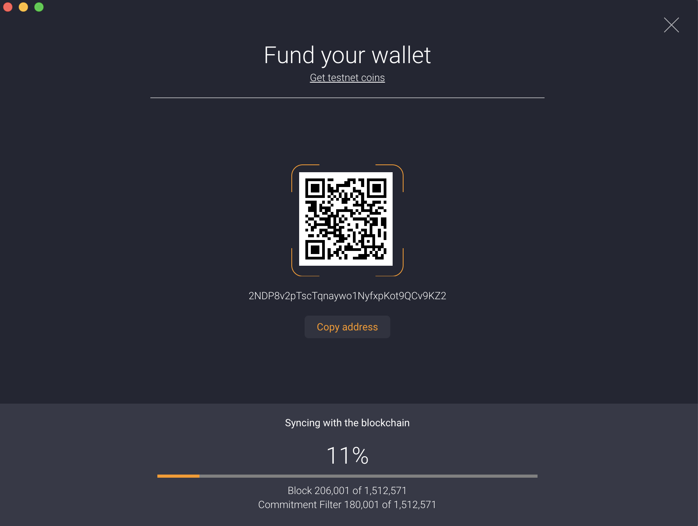

# Introduction

{{site.title}} is a guide for building an app that accepts Bitcoin payments on the Lightning Network.

Unlike other guides, {{site.title}} focuses on getting a fully functional Lightning app with the lowest amount of time and effort.

The whole guide shouldn't take more than 2 hours.

**Things you can build include..**
- A VPN that charges by the hour
- A Bitcoin tipping bot for Twitter
- A cloud service provider that doesn't require identification  
- A service that sells AI training data by the Megabyte
- An adult content website with builtin micropayments

**This guide is for anyone who..**

- Wants to build a Bitcoin app but hesitates because transactions are slow, expensive and/or not private.
- Has an idea for a micropayment app but hasn't found a way to build it. 
- Has heard of Lightning Network and wants to learn by building on it.
- Has tried to follow other guides but gave up because they were too difficult.

**This guide will help you..**

- Build a fully-functional app that accepts Lightning Network payments.
- Understand roughly what Lightning Network is, how it works and how to build on it.
- Become more familiar with Lightning wallet and node software.

**This guide assumes basic knowledge of..**

- Web development
- NodeJS and ExpressJS
- Bitcoin

# Background

## Why Bitcoin?

While there are other cryptocurrencies you could build on, the author of this guide believes Bitcoin is currently the best option.
It has a proven 10+ year track record of not getting hacked or politically subverted.
As a result it has the most liquid market, the most stable price and the best brand recognition.

So far, Bitcoin is shaping up to be a true native currency for the Internet. 

From a developer standpoint, the biggest downside of Bitcoin is that transactions are slow and expensive. 
The Lightning Network fixes this flaw by adding a new layer on top of Bitcoin.

## What is Lightning Network?

<small>TODO: Verify copyright</small>


Lightning Network (also known as "Lightning" or "LN") is a second layer network on top of Bitcoin.
Unlike traditional Bitcoin payments, payments on Lightning Network are extremely fast, cheap and anonymous.

It uses a construct called a payment channel: a "virtual money tube" between two peers.
A network of these channels plus special Bitcoin scripts called [HTLCs](https://en.bitcoin.it/wiki/Hash_Time_Locked_Contracts) 
enables payments to be routed through peers that don't have to trust each other. [Read more about the underlying technology](https://lightning.engineering/technology.html).

Lightning Network is still at an early stage. 
Its interface is still in flux, and there aren't accepted standards on how to do interact with it yet from an app's perspective.
This guide follows the best currently known practices, but these are subject to change in the future.   

# Building the App

In this guide we're going to build a NodeJS + ExpressJS example web app which sells weather reports for Lightning micropayments called Rain Report.

**Note**: Building a real Weather API is out of scope for this guide. The app will return hardcoded reports.

## Create web app

Start by creating a vanilla NodeJS/ExpressJS project. For simplicity, this app will be API-only.

```bash
$ mkdir rain-report
$ cd rain-report
$ yarn init
$ yarn add express
```

Add a file "index.js" which will contain our entire web app.

```javascript
const express = require("express")

async function start() {
    const app = express()
    
    app.get("/weather", async (req, res) => {
      res.end("Uh oh! You need to pay first.")
    })
    
    app.listen(8000)
}

start().then(() => console.log("Listening on :8000"))
```

Now let's run it.

```bash
$ node index.js
Listening on :8000
```

We can see it working.

```bash
$ curl localhost:8000/weather/
Uh oh! You need to pay first.
```

Of course you can't actually pay yet. Let's fix that.

## Start Lightning node

To accept Lightning payments, first we need to run a node on the Lightning Network.
For this guide we'll be using the [LND](https://github.com/lightningnetwork/lnd) Lightning node implementation, written in Go.

**Note:** Don't worry about losing money: the Lightning node will run on the test network (testnet), which doesn't use real Bitcoins. 
 
To make this easy we use [Docker](https://www.docker.com/products/docker-desktop). 

1. Paste the underlying code into a file called "docker-compose.yml". [(Direct link)](rain-report/docker-compose.yml)
1. Run `docker-compose up`

```yaml
version: "3.7"

services:
  lnd:
    image: btcpayserver/lnd:v0.6-beta
    ports:
      - "9735:9735"
      - "10009:10009"
    volumes:
      - ./lnd_data:/root/.lnd
    command: >
      lnd
        --debuglevel=info
        --externalip=0.0.0.0
        --rpclisten=0.0.0.0:10009
        --bitcoin.active
        --bitcoin.testnet
        --bitcoin.node=neutrino
        --neutrino.connect=faucet.lightning.community
```

That's it! You are now running a node on the Lightning test network which exposes the port 10009 for Remote Procedure Calls (RPC).

It will take some time (1-10 mins) for the node to sync to the Bitcoin blockchain. But you can continue with the next step in the meanwhile.  

**Sidenote: The Big Bitcoin Blockchain**

*Because of how Lightning Network works, a node needs to be able to read from the Bitcoin blockchain and send transactions to it.
To achieve this, the Lightning node you're running uses a Bitcoin backend called [Neutrino](https://github.com/lightninglabs/neutrino).*

*Neutrino is a Bitcoin "light client", meaning it doesn't download and verify all 200GB+ of the Bitcoin blockchain but instead only verifies transactions
relevant to its own wallet. This makes it a lot easier and cheaper to run a node, which is why this guide uses it.*

*Neutrino is still early days and potentially insecure. 
That means that once you migrate off testnet and start handling real money,
you'll need to run a "full" Bitcoin node that processes and stores every block in the blockchain.*

**Next step: Initializing the Lightning node's wallet**

Before your app can get paid, you need to initialize your Lightning "wallet": the private key used to control money on your Lightning node. 

To do this, we'll run the `lncli create` command inside the Docker container and generate a new random private key.

Since the node is on testnet, security isn't that important: you can pick a simple 8-character wallet password like "satoshi7".

```bash
$ docker-compose exec lnd lncli create
Input wallet password: satoshi7
Confirm wallet password: satoshi7

Do you have an existing cipher seed mnemonic you want to use? (Enter y/n): n

Your cipher seed can optionally be encrypted.
Input your passphrase if you wish to encrypt it (or press enter to proceed without a cipher seed passphrase):

Generating fresh cipher seed...
```
The command will print out your "cipher seed mnemonic": 24 English words that map one-to-one to your generated private key.
You can ignore this for now and move on to the next section. 

**Sidenote: Security on Production**

*When the app is migrated to mainnet, you'll need to generate a new mnemonic and store it in a secure place, like in 1Password or on a piece of paper.
You should also use a different, secure wallet password or your money might get stolen.*

*Please make sure you don't lose either your password or your mnemonic. 
Unlike traditional payment methods such as Stripe or Paypal, with Bitcoin+Lightning there's no one to bail you out if you lose them.*

## Connect web app to Lightning

An app communicates with a Lightning node using an RPC protocol called [`grpc`](https://grpc.io/).   
The Node package we'll be using for this is called `@radar/lnrpc`.
```bash
$ yarn add @radar/lnrpc
```

In "index.js",
```javascript
const express = require("express")
const connectToLnNode = require("@radar/lnrpc")

async function start() {
    const app = express()
    
    const lnRpc = await connectToLnNode({
        // TODO
    })
    
    // ...
}
```

The app needs three pieces of information to connect to the node:

1. Address and port, to locate the node.
2. TLS certificate, which authenticates the node.
3. Macaroon, an authentication string which enables the app to perform privileged actions like requesting money.  

The first one is easy: the node is running locally and exposes the RPC interface on port 10009.

```javascript
const lnRpc = await connectToLnNode({
    server: "localhost:10009",
    // TODO
})
```

LND generates the last two as files: `tls.cert` and `admin.macaroon`. They're in the `lnd_data/` directory, so we write:  

```javascript
const lnRpc = await connectToLnNode({
    server:         "localhost:10009",
    tls:            "./lnd_data/tls.cert",
    macaroonPath:   "./lnd_data/data/chain/bitcoin/testnet/admin.macaroon",
})
```

Test the connection by calling the [`getInfo`](https://api.lightning.community/#getinfo) Lightning RPC method.

```javascript
const lnRpc = await connectToLnNode({
    //...
})
console.log(await lnRpc.getInfo())
``` 

You should get output that looks like this.
```
{ identityPubkey:
   '020bf2ea1558744cdbf3145d7693c912fa326ecac921627491590878bb7a45d4fc',
  alias: '020bf2ea1558744cdbf3',
  ... }
```

**Note**: If you get an error here, it might be because the Lightning node isn't done syncing with the blockchain yet. 
In that case, wait for a couple of minutes before trying again. 

**Sidenote: Unlocking your Wallet**

*In the future, you might get an error when calling RPC methods that looks like `Error: 12 UNIMPLEMENTED: unknown service lnrpc.Lightning`.*

*This is because when a Lightning node restarts with a wallet already initialized, it blocks calls to most RPC methods until it's unlocked with the wallet password.
There are two ways to unlock it, which one you should use depends on your needs.*

*1. Manually execute an `lncli unlock` command after the node starts up and enter the wallet password.
Remember, in our case you would have to run `docker-compose exec lnd lncli unlock`.*

*2. Use the `unlockWallet` method on `lnRpc` in your code.
If you do this, make sure you don't hardcode the wallet password or it might get leaked when you commit it to Version Control.*

## Generate payment request

To charge money for the `/weather` API call we need to generate a request for a Bitcoin Lightning payment. In Lightning-land this is called an "invoice".

Lightning's RPC interface exposes a method called [`addInvoice`](https://api.lightning.community/#addinvoice) that does just that.
Let's change the route handler to use it. 

```javascript
app.get("/weather", async (req, res) => {
    const invoice = await lnRpc.addInvoice({
      value: 1, // 1 satoshi == 1/100 millionth of 1 Bitcoin
      memo: `Weather report at ${new Date().toString()}` // User will see this as description for the payment
    })
     // Respond with HTTP 402 Payment Required
    res.status(402).send(invoice.paymentRequest)
})
```

Great! Let's test it.

```bash
$ curl localhost:8000/weather
lntb10n1pwvyxdxpp52ghumrwlvy9w2dwszw6peswy076f44juljqaje0s3dycvq6q4f0sdrc2ajkzargv4ezqun9wphhyapqv96zq4rgw5syzurjyqer2gpjxqcnjgp3xcarxve6xsezq36d2sknqdpsxqszs3tpwd6x2unwypzxz7tvd9nksapq235k6effcqzpguxmnk2rlqjw0lfq966q6szq3cy8dw2mxwjnxz6j5kfukm539s0wkvf8tmnh37njlydc6exr7yjl6j008883jxrrgkzfdv60lpjdf9vgptrxpms```
```

That long response string is the entire invoice encoded in a [special format](https://github.com/lightningnetwork/lightning-rfc/blob/master/11-payment-encoding.md), which the user enters it into their Lightning wallet to pay.

We don't have a user wallet yet, so let's set one up.

## Set up user wallet

To set up a user wallet, install the [Zap Desktop Wallet](https://github.com/LN-Zap/zap-desktop#install).
Using a desktop wallet app makes it easier to distinguish between the "server" wallet and the "user" wallet, and it provides a nice
graphical interface.

Follow the setup in the Zap desktop wallet. It will be very similar to the one you did earlier with `lncli`. Again, you'll have to wait a little while (1-10 mins)
for the wallet to sync with the blockchain.



While it's syncing, let's get some free testnet Bitcoins. (Don't get your hopes up; testnet Bitcoins are not worth any money :)

The best way to get testnet Bitcoins is through a "faucet": a service that gives out free coins.
There's a few of them online, but my favourite is [Yet Another Bitcoin Testnet Faucet](https://testnet-faucet.mempool.co/).

The faucet will ask you for a (Bitcoin) Address. Click "Copy address" on the syncing screen of Zap, or 
if your wallet is done syncing, the QR icon to the left of your account balance.

Once you click "Send", the transaction will take a while to be confirmed on the test network. 

## Open a channel

Now that the user wallet has testnet Bitcoins in it, it can open a channel with your Lightning node.

A Lightning wallet needs two pieces of information to open a channel: the IP address and the public key of your Lightning node.
The public key of your Lightning node can be found with the `lncli getinfo` command (pass the `-n testnet` option to specify you're talking about testnet).
```bash
$ docker-compose exec lnd lncli -n testnet getinfo
{
    "version": "0.6.0-beta commit=basedon-v0.6-beta-dirty",
    "identity_pubkey": "02716b1bae882f7a24494099d9b0be8c06ed5608bf1bf9de0963c496f3d0c01224",
    ...
```
Here is the public key: the value of "identity_pubkey". Copy it.

The address is once again localhost, but we use a different port this time: 9735. 

In Zap, 
- Click on the name of your wallet in the top right
- Select "Manage Channels", and click "Create New"
- Enter `<YOUR_PUBKEY>@localhost:9735` into the search field
- Enter an amount around 0.001 tBTC (or 100,000 tsatoshis)
- Select "Fast" (because we're impatient like that :)
- Click "Next" and "Open Channel" 

This will create a channel with your Lightning server node.
 
It'll take a while for the transaction to be confirmed and the channel to be opened. You can grab a coffee or something in the meanwhile.


**Sidenote: Inbound Liquidity**

*In Lightning nomenclature the amount of Bitcoin on the other side of your channels is called "inbound liquidity", and the lack of it is 
a tough problem that holds back widespread adoption. A lot of smart people
are trying to come up with solutions. Time will tell whether they succeed.*

*In the real world, both you and the user would likely open a channel with a well-connected hub to route payments as opposed to opening a direct channel.*

*--- SOME MORE STUFF ABOUT LIQUIDITY TO KEEP READER BUSY ---*

## Pay the invoice

Once your channel is officially opened, you can finally purchase a weather report from your API.

As a reminder, first fire off a request for a weather report. 

```bash
$ curl localhost:8000/weather
lntb10n1pwvyxdxpp52ghumrwlvy9w2dwszw6peswy076f44juljqaje0s3dycvq6q4f0sdrc2ajkzargv4ezqun9wphhyapqv96zq4rgw5syzurjyqer2gpjxqcnjgp3xcarxve6xsezq36d2sknqdpsxqszs3tpwd6x2unwypzxz7tvd9nksapq235k6effcqzpguxmnk2rlqjw0lfq966q6szq3cy8dw2mxwjnxz6j5kfukm539s0wkvf8tmnh37njlydc6exr7yjl6j008883jxrrgkzfdv60lpjdf9vgptrxpms```
```
  
Now, click "Pay" in Zap and paste the invoice. Once you click "Send", payment shouldn't take longer than a few seconds.

Voilá! Your first weather report has been bought and paid for. 

Actually, you might notice you didn't get a report back from the API call.
That's because we haven't written any code to verify the fact that a report was paid for, and if so to send it to the user. 

## Verify purchases on server

Last step! 

To verify the purchase of a report we need to do three things:
1. Generate a unique token for each new purchase along with the invoice.
2. Read paid invoices as they come in and mark their corresponding purchase tokens.
3. Send report to users who have paid only by checking the token.

We're going to send the purchase token as an HTTP header called `X-Purchase-Token`. 

To make it simple we're using UUIDs as purchase tokens. Add the `uuid` package to your project. 
```bash
$ yarn add uuid
```

Require it at the top of "index.js"
```javascript
const uuid = require("uuid")
```

On a `/weather` API call, generate a new UUID to use as purchase token. Include it in the invoice memo so that we can
mark it as paid later when we're reading invoices.

```javascript
app.get("/weather", async (req, res) => {
    const purchaseToken = uuid.v4()
    const invoice = await lnRpc.addInvoice({
        value: 1, // 1 satoshi == 1/100 millionth of 1 Bitcoin
        memo: `Weather report at ${new Date().toString()} || ${purchaseToken}`,
    })
    res.status(402)
        .header("X-Purchase-Token", purchaseToken)
        .send(invoice.paymentRequest)
})
```

We need to mark purchase tokens as paid by reading invoices on the fly.
The RPC method we're going to use for this is [`subscribeInvoices`](https://api.lightning.community/#subscribeinvoices).

```javascript
const hasBeenPaid = {} // You should use a real database instead
const invoiceStream = await lnRpc.subscribeInvoices()
invoiceStream.on("data", (invoice) => {
    if (invoice.state === 1) { // State 1 means settled i.e. paid
        const purchaseToken = invoice.memo.split("||")[1].trim()
        hasBeenPaid[purchaseToken] = true
    }
})
```

Finally, tie it all together by checking for a `X-Purchase-Token` request header and returning the report if the header is a valid, paid purchase token.

```javascript
app.get("/weather", async (req, res) => {
    const purchaseToken = req.header("X-Purchase-Token")
    if (purchaseToken) {
        if (hasBeenPaid[purchaseToken]) {
            res.send("Weather report: 15 degrees Celsius, cloudy and with a chance of lightning.")
        } else {
            res.status(400).send("Error: Invoice has not been paid")
        }
    } else {
        const purchaseToken = genPaymentToken()
        const invoice = await lnRpc.addInvoice({
            value: 1, // 1 satoshi == 1/100 millionth of 1 Bitcoin
            memo: `Weather report at ${new Date().toString()} || ${purchaseToken}`,
        })
        res.status(402)
            .header("X-Purchase-Token", purchaseToken)
            .send(invoice.paymentRequest)
    }
})
```

Let's test it. Note we use the `curl -v` option to obtain the `X-Purchase-Token` header.
```bash
$ curl -v localhost:8000/weather
...

< HTTP/1.1 402 Payment Required
< X-Powered-By: Express
< X-Purchase-Token: d439499f-237b-4e28-9fc3-d1854144ced4
< Content-Type: text/html; charset=utf-8
< Content-Length: 372
< ETag: W/"174-+SX9JPCZpKw9P96pvXIXPsOn5Pc"
< Date: Mon, 29 Apr 2019 19:02:42 GMT
< Connection: keep-alive
<
* Connection #0 to host localhost left intact
lntb10n1pwvwjjjpp5fnrkz0sa830s8lqza8tdflwqr8s6cegvqkmy60a44qfc79t5fh4qd9c2ajkzargv4ezqun9wphhyapqv96zqnt0dcsyzurjyqerjgpjxqcnjgp3x5arqv36xsezq36d2sknqdpsxqszs3tpwd6x2unwypzxz7tvd9nksapq235k6effyqhj7gryxsenjdpe89nz6v3nxa3z6dr9xguz6wtxvvej6ep38q6ngvf5x33k2ep5cqzpg6rk3card20ca5j3p0x70waz3xa6y4zjjp8e9m0wd8356850hkcuklmpfvmkluz8y0l2yer74j5ja3ar5grej6mjk6d262etwpv3mcxcppxkr6d
```

We see the purchase token as well as the Lightning invoice.
Enter the invoice into the user's wallet and pay it, then re-call the API with the purchase token in the HTTP header.

```bash
$ curl localhost:8000/weather -H X-Purchase-Token:d439499f-237b-4e28-9fc3-d1854144ced4
Weather report: 15 degrees Celsius, cloudy and with a chance of Lightning.
```

**Done!**

You've successfully built a Lightning app from scratch and without prior knowledge. Congrats!

[Here's the entire completed project.](https://github.com/mvanderh/pragmatic-lightning/blob/master/rain-report)

The next step is to move your app off of Lightning testnet and onto production where you can get paid with real money.

**Sidenote: User Experience**

*Obviously, this is not how you'd want a user to interact with your app: `curl`ing a URL, 
pasting the invoice into their app, clicking pay and then `curl`ing again to get the report. Quite the pain for something so banal.*

*To make your app more user-friendly, I'd recommend either adding a Web UI to your app and using 
[Lightning Payment URIs](https://github.com/lightningnetwork/lightning-rfc/blob/master/11-payment-encoding.md#encoding-overview) or 
[WebLN](https://github.com/joule-labs/webln) to push invoices,
 or writing a client-side app that handles Lightning payments for the user automatically.* 

# Migrating to Production

Let's make some real money.

## Switch to mainnet

For an app to accept real Bitcoins, the Lightning node it talks to needs to run on mainnet. 

In the future this will be as easy as adding the `--bitcoin.mainnet` config flag to your "docker-compose.yml".

Unfortunately as of now (Apr 30, 2019) the Neutrino Bitcoin node used in this guide is still experimental, 
and thus LND won't allow you to use it on mainnet where money could be lost.
Therefore you need to run a full Bitcoin node which downloads and verifies the whole 200GB+ blockchain.

There are two ways to do this:
 
1. Write a "docker-compose.yml" for production which includes a full Bitcoin node.
1. Install and run the node daemons manually on your local machine, not via Docker.

For both options you need at least 500GB of disk space so that you can store the full Bitcoin blockchain now and well into the future.
Make sure of this when you set up your app on a cloud service like Digital Ocean or AWS. 

**Docker-compose.yml for production**

I've written a ["production" docker-compose.yml file](./rain-report/docker-compose.production.yml) 
that includes Docker containers for both the mainnet Bitcoin node and the mainnet Lightning node,
and connects them to each other. 

I also included a container and Dockerfile for the web app that sets convenient environment variables for the app to connect to Lightning.
You can find all this code in [the Rain Report project folder](https://github.com/mvanderh/pragmatic-lightning/blob/master/rain-report).

To use the production docker-compose.yml, run
 
```bash
$ curl -O https://mvanderh.github.io/pragmatic-lightning/rain-report/docker-compose.production.yml -O https://mvanderh.github.io/pragmatic-lightning/rain-report/Dockerfile
$ docker-compose -f docker-compose.production.yml up
```

**Run without Docker**

Alternatively, you can choose to install and run the Bitcoin and Lightning nodes directly on the machine. 
There are many guides that will help you do this. 
The best and most up to date is probably the [LND installation guide](https://github.com/lightningnetwork/lnd/blob/master/docs/INSTALL.md).

**Re-initialize Lightning node wallet**

Once you've switched to mainnet, you need to re-initialize your Lightning wallet. 
Follow the same procedure from the [Start Lightning node](#start-lightning-node) section, but use a secure wallet password this time and
save the 24-word mnemonic in a safe place. 

**Migrate web app**

From the web app's perspective only one thing has to change for it to work on mainnet: the path to the Macaroon that it uses.
In the [completed version of the Rain Report app](https://github.com/mvanderh/pragmatic-lightning/blob/master/rain-report)
 I've included an environment variable to make this easy.
 
**Get inbound liquidity**

Lastly, you need to have other Lightning nodes open channels with you so that you can get paid by users. 

At such an early stage of development as we are, this is still pretty difficult. There are free services that will
open a channel with you, such as [LNBig](https://lnbig.com) or [LightningTo.me](https://lightningto.me/)

There are also services which require a fee, for instance [Thor](https://www.bitrefill.com/thor-lightning-network-channels/?hl=en).
Presumably these paid hubs are better connected or ask lower routing fees.

This problem is sure to become easier over time as more people join the Network and more hubs spring into existence.

## Best practices

A few best practices to follow to ensure your money doesn't get stolen or lost:

- Update LND when a new version comes out to fix security bugs (and to get cool new features). 
- Until Lightning Network becomes more mature, don't put more than $50 USD on Lightning node wallet.
- Run the app under a separate Unix user from the Lightning and Bitcoin nodes.

**Ending**

This guide was borne out of frustration in setting up Lightning for my own app, [MeterVPN](https://metervpn.com).
I read through multiple guides and made many mistakes to get it set up, and this guide is a way of protecting others from the same fate.    

Thanks for reading! 

